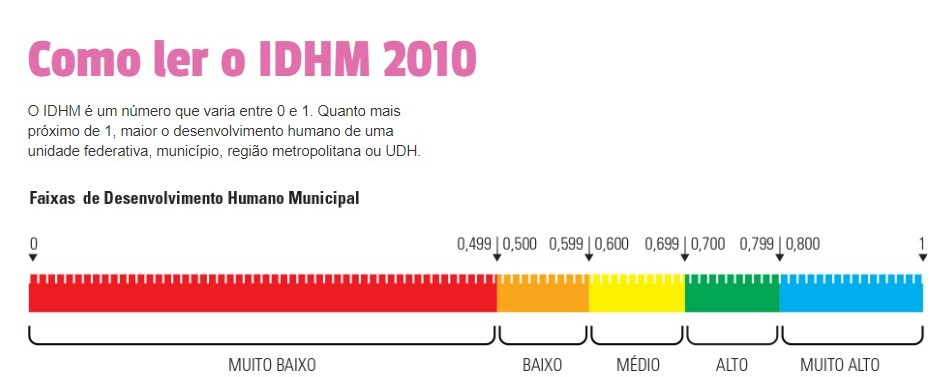

<style>
  .col2 {
    columns: 2 200px;         /* number of columns and width in pixels*/
    -webkit-columns: 2 200px; /* chrome, safari */
    -moz-columns: 2 200px;    /* firefox */
  }
</style>


# INTRODUÇÃO 

De acordo com o Programa das Nações Unidas para o Desenvolvimento  [(PNUD)](http://www.br.undp.org/content/brazil/pt/home/idh0/conceitos/o-que-e-desenvolvimento-humano.html), o conceito de desenvolvimento humano consiste em avaliar as oportunidades e capacidades individuais da população. Ao pensar em desenvolvimento humano, pode ser intuitivo associá-lo imediatamente ao ponto de vista econômico, porém a ideia é considerar também aspectos sociais, culturais e políticos.

A proposta do Índice de Desenvolvimento Humano tem por objetivo oferecer uma alternativa à análise do progresso social a partir, do ponto de vista econômico, utilizando o Produto Interno Bruto (PIB). Embora, seja uma nova possibilidade de mensurar o desenvolvimento, o índice não contempla a representação da "felicidade", ou seja, não considera a pessoa na sua individualidade, mas seu comportamento em relação a um grupo (sociedade).

Sob a perspectiva municipal, foi adaptado o conceito de Índice de Desenvolvimento Humano para as cidades (IDHM). O indicador apresenta a mesma ideia do IDH de forma geral.

## CONTEXTUALIZAÇÃO DO PROBLEMA 

Os municípios do estado do Rio de Janeiro apresentam comportamentos diferentes. Algumas diversidades podem ser observadas de acordo com a posição geográfica, a condição social, cultural, histórica, econômica, entre outras. Esses atributos podem ser responsáveis por diferentes níveis de desenvolvimento. Portanto, este trabalho consiste em classificar o IDHM a partir de informações municipais.

# DADOS 

```{r, echo=F, warning=F,message=F}
knitr::opts_chunk$set(comment = NA)
require(readxl)
require(dplyr)
require(rpart)
require(rpart.plot)
require(magrittr)

dados <- read_xlsx("AtlasBrasil_Consulta (1).xlsx")
regiao <- read_xlsx("ordem_mun.xlsx")

dados %<>%
  select(1:2, idhm = `IDHM 2010`, everything()) %>% 
  mutate(idhm = case_when(
    idhm > 0.7 ~ "alto",
    idhm <= 0.7 & idhm > 0.6 ~ "médio",
    T ~ "baixo"
  )) %>%
  inner_join(regiao, by = c("Espacialidades" = "Cidade"))
  
dados2 <- dados %>%
  select(-c(1:2,4:25,27:41,43:151,153:204,206:227)) %>% 
  distinct()


```


O banco de dados é formado por `r nrow(dados2)` registros, referentes aos `r nrow(dados2)`  municípios do estado do Rio de Janeiro. As informações foram extraídas do [Atlas Brasil](http://www.atlasbrasil.org.br/2013/pt/consulta/) . Inicialmente, foram coletadas 
`r ncol(dados) - 2` variáveis. Em seguida, também foram obtidas informações sobre as mesorregiões correspondentes aos municípios.

O IDHM foi encontrado no formato numérico e categorizado, adaptando as categorias abaixo para apenas 3:



- **Alto** : Alto e Muito Alto
- **Médio**: Médio
- **Baixo**: Baixo e Muito Baixo


```{r}
dados2 %>% 
  count(idhm)
```

De acordo com o critério de classificação adotado a partir da imagem acima, podemos perceber que não existem municípios com IDHM baixo no estado do Rio de Janeiro. Portanto, existem apenas duas categorias: alto e médio.

## METODOLOGIA

Para obtermos e avaliarmos a classificação do IDHM, a base de dados foi dividida em treino e teste. A base a ser treinada conta com 80% dos municípios.  As cidades restantes, que indicam 20% da base de dados, serão utilizadas para teste.


```{r}
set.seed(12)
index <- sample(1:nrow(dados2), 0.8*nrow(dados2))
dados_treino <- dados2[index, ]
dados_teste <- dados2[-index, ]
```

As tabelas abaixo são referentes aos dados de treino e de teste, respectivamente.

<div class="col2">

```{r,echo=F}
as_tibble(dados_treino)
```

```{r,echo=F}
head(as_tibble(dados_teste),10)
```
</div>


Para a classificação do IDHM foi utilizada a técnica de mineração de dados conhecida como **árvore de classificação**. A árvore analisa como cada variável influencia na distribuição do atributo a ser classificado.

Para a execução do algoritmo, utilizamos a função `rpart` do pacote `rpart` e, para a visualização da árvore, foi utilizada a função `rpart.plot` do pacote `rpart.plot`.

## MODELOS
Foram ajustados 4 modelos considerando as seguintes variáveis:

- Modelo 1: Todas as variáveis
- Modelo 2: Mesorregião
- Modelo 3: Renda per capita no ano de 2010
- Modelo 4: Percentual de empregados com carteira assinada (18 anos ou mais em 2010) , Mesorregião e Rendimento médio dos ocupados (18 anos ou mais em 2010)

```{r}
modelo1 <- rpart::rpart(idhm ~ ., data = dados_treino, method = "class")
rpart.plot::rpart.plot(x = modelo1, yesno = 2,
           type = 0, extra = 2)

modelo2 <- rpart::rpart(idhm ~ Mesorregiao, data = dados_treino, 
                        method = "class")
rpart.plot::rpart.plot(x = modelo2, yesno = 2,
                       type = 0, extra = 2)

modelo3 <- rpart::rpart(idhm ~ `Renda per capita 2010`,
                        data = dados_treino, method = "class")
rpart.plot::rpart.plot(x = modelo3, yesno = 2,
                       type = 0, extra = 2)

modelo4 <- rpart::rpart(idhm ~ `% de empregados com carteira - 18 anos ou mais 2010` + Mesorregiao + `Rendimento médio dos ocupados - 18 anos ou mais 2010`,
                        data = dados_treino, method = "class")
rpart.plot::rpart.plot(x = modelo4, yesno = 2,
                       type = 0, extra = 2)

```

Avaliando todas as variáveis disponíveis no banco de dados, o modelo 1 utilizou como critério de classificação as variáveis Rendimento médio dos ocupados com 18 anos ou mais (2010) e Percentual de jovens de 18 a 20 anos com ensino médio completo em 2010.

Os modelos 2 e 3 foram construídos considerando apenas uma variável e o modelo 4 considerou como critério de classificação apenas a variável Rendimento médio dos ocupados com 18 anos ou mais, em 2010. 

## Medidas de Avaliação

> Previsão de classificação

```{r}
prev1 <- predict(modelo1, dados_teste, type = "class")
prev2 <- predict(modelo2, dados_teste, type = "class")
prev3 <- predict(modelo3, dados_teste, type = "class")
prev4 <- predict(modelo4, dados_teste, type = "class")

```

> Medidas de Acurácia a partir da Matriz de Confusão 

```{r}
# Calculando medidas de acurácia
mat_conf1 <- caret::confusionMatrix(data = prev1, reference = as.factor(dados_teste$idhm))
mat_conf2 <- caret::confusionMatrix(data = prev2, reference = as.factor(dados_teste$idhm))
mat_conf3 <- caret::confusionMatrix(data = prev3, reference = as.factor(dados_teste$idhm))
mat_conf4 <- caret::confusionMatrix(data = prev4, reference = as.factor(dados_teste$idhm))

```
A seguir veremos a matriz de confusão correspondente a cada modelo:

<div class="col2">
```{r,echo=F}
mat_conf1$table


```

```{r,echo=F}
mat_conf2$table

```
</div>

<div class="col2">
```{r,echo=F}
mat_conf3$table

```

```{r,echo=F}
mat_conf4$table
```
</div>

```{r}
rbind(mat_conf1$overall, mat_conf2$overall, 
      mat_conf3$overall, mat_conf4$overall) %>%
  cbind(rbind(mat_conf1$byClass, mat_conf2$byClass, 
        mat_conf3$byClass, mat_conf4$byClass)) %>% 
  as_data_frame() %>% 
  mutate(Modelo = paste("Modelo", 1:4)) %>% 
  select(Modelo, -Kappa, -starts_with("Accuracy"), Accuracy, Sensitivity, 
         Specificity) %>% 
  arrange_at(vars(-Modelo), desc)


```

Quanto maior a sensitividade, mais elementos positivos são classificados, de fato, como positivos, ou seja, municípios de IDHM alto sendo considerados como altos.

Por outro lado, a especificidade tem maior precisão para classificar negativos como, de fato, negativos, ou seja, classifica melhor o IDHM médio.

Entende-se por acurácia a proporção de acertos na base de teste.

# CONCLUSÃO 

De acordo com a acurácia, o modelo 3 tem maior proporção de acertos. O modelo 3 também apresenta maior sensitividade. Portanto ao classificar um município que possui realmente um IDHM alto, esse modelo tem o melhor desempenho. 


De acordo com a especificidade, o modelo 1 e o modelo 4 são os que mais acertam IDHM médio, mas como o modelo 4 possui maior acurácia e sensitividade, podemos afirmar que seu desempenho é melhor do que o do modelo 1.


