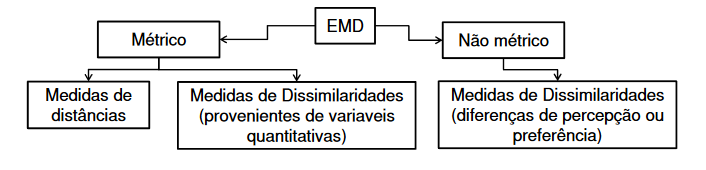

```{r setup, include=FALSE}
knitr::opts_chunk$set(echo = TRUE)
```

O escalonamento multidimensional é uma técnica de interdependência que permite mapear distâncias entre objetos.

A técnica do Escalonamento Multidimensional é usada para representar espacialmente uma matriz de proximidades (semelhança ou dissemelhança) entre uma série de objetos de modo que possam ser mais facilmente visualizados. 

A técnica é apropriada para representar graficamente $n$ elementos em um espaço de dimensão menor do que o original, levando-se  em conta  a  distância  ou  a similaridade que os elementos têm entre si.



# Escalonamento Multidimensional Métrico

## Modelagem do Escalonamento Multidimensional Métrico

O escalonamento multidimensional métrico é feito conforme os seguintes passos:

1. Uma configuração inicial é estabelecida para os $n$ objetos em $k$.  dimensões.

2. As distâncias euclidianas entre os objetos são calculadas para a configuração assumida. Seja $d_{ij}$ a distância entre o objeto $i$ e o objeto $j$ para esta configuração.

3. Uma regressão de $d_{ij}$ em $\delta_{ij}$ é feita onde,como mencionado acima,$\delta_{ij}$ é a distância entre o objeto $i$ e o objeto $j$, de acordo com os dados de entrada. A regressão pode ser linear, polinomial ou monótona.

4. A qualidade de ajuste entre as distâncias de configuração e as disparidades é medida por uma estatística adequada.

5. As coordenadas de cada objeto são alteradas levemente de tal maneira que o stress é reduzido.

### Medidas de adequação do ajuste

Algumas medidas para avaliar o quanto as distâncias derivadas dos dados dissimilaridades se aproximam daqueles originais fornecidas pelos respondentes são:

- Stress, Kruskal

$$ STRESS = \sqrt{\frac{\sum_i \sum_j (d_{ij} - \hat{d_{ij}})^2}{{\sum_i \sum_j \hat{d_{ij}}^2}}} $$

- Stress, Young

$$SSTRESS= \sqrt{\dfrac{\sum_i \sum_j (d_{ij}^2 - \hat{d_{ij}}^2)^2}{\sum_i \sum_j \hat{d_{ij}}^4}}$$

| STRESS | Adequação do Ajuste |
|:------:|:-------------------:|
|   20\% |        Pobre        |
|  10\%  |       Razoável      |
|   5\%  |         Bom         |
|  2,5\% |      Excelente      |
|   0\%  |       Perfeito      |


## Escalonamento Multidimensional do R


# Escalonamento Multidimensional Não-Métrico

Dados de preferência ou percepção quanto à proximidade dos pares que estão sendo avaliados.
